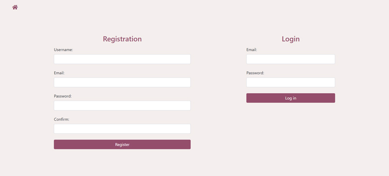

## Java Authentication 
### Introduction
A simple registration/login application that can be used in different Java projects 

### Running Locally
* Clone the repository with `git clone https://github.com/MaryamWeb//java_authentication` or download it. 
* Open Eclipse: File -> Import -> Existing Project into Workspace -> Select the project.
* In MySQL create a schema for the project `create schema basic_authentication;` .
* Open the file `src/main/resources/application.properties` and add your Username and Password.
* Open `src/main/java/BasicAuthenticationApplication.java` -> run as -> Spring Boot App

Check the server at `http://localhost:8080`

## Project Screenshot:

